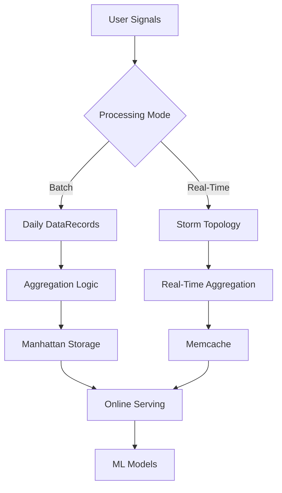
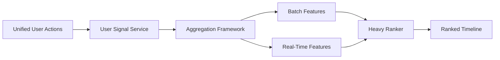

## Overview

The **Timelines Aggregation Framework** is a set of libraries and utilities that allows teams to flexibly compute aggregate (counting) features in both batch and real-time. Aggregate features can capture historical interactions between arbitrary entities (and sets thereof), conditional on provided features and labels.

<Note>
These types of engineered aggregate features have proven to be highly impactful across different teams at Twitter.
</Note>

## What Are Aggregate Features?

Aggregate features are computed on provided grouping keys with the constraint that these keys must be **sparse binary features** (or sets thereof).

### Common Use Cases

<AccordionGroup>
  <Accordion title="User Engagement History">
    Calculate a user's past engagement history with various types of tweets (photo, video, retweets, etc.), specific authors, or specific in-network engagers.
    
    **Aggregation keys**: `userId`, `(userId, authorId)`, `(userId, engagerId)`
  </Accordion>
  
  <Accordion title="Tweet-Level Aggregates">
    Compute custom aggregate engagement counts on every `tweetId` for Timelines and MagicRecs.
    
    **Aggregation keys**: `tweetId`, `(tweetId, userId)`
  </Accordion>
  
  <Accordion title="Other Entity Aggregates">
    Calculate aggregates on other entities like advertisers or media.
    
    **Aggregation keys**: `advertiserId`, `mediaId`
  </Accordion>
</AccordionGroup>

## Framework Capabilities

The framework supports computing aggregate features on any sparse binary grouping key:

<CardGroup cols={2}>
  <Card title="Batch Processing" icon="calendar">
    Daily batch processing of DataRecords containing all required input features
  </Card>
  <Card title="Real-Time Streaming" icon="bolt">
    Real-time aggregation through Storm with memcache backing
  </Card>
  <Card title="Flexible Keys" icon="key">
    Support for arbitrary sparse binary features as grouping keys
  </Card>
  <Card title="Conditional Aggregation" icon="filter">
    Compute aggregates conditional on provided features and labels
  </Card>
</CardGroup>

## Implementation Details

### Offline (Batch) Implementation

<Steps>
  <Step title="Data Collection">
    Daily batch processing of DataRecords containing all required input features to generate aggregate features
  </Step>
  <Step title="Aggregation">
    Compute aggregate counts based on configured grouping keys and conditions
  </Step>
  <Step title="Storage">
    Upload computed features to Manhattan for online hydration
  </Step>
  <Step title="Serving">
    Features are hydrated from Manhattan during inference
  </Step>
</Steps>

### Online (Real-Time) Implementation

<Steps>
  <Step title="Stream Processing">
    Real-time aggregation of DataRecords through Storm topology
  </Step>
  <Step title="Cache Layer">
    Backing memcache stores real-time aggregate features
  </Step>
  <Step title="Query Interface">
    Features can be queried in real-time for immediate use
  </Step>
  <Step title="Feature Freshness">
    Continuously updated as new user actions occur
  </Step>
</Steps>

## Architecture



## Example Features

Here are some examples of aggregate features that can be computed:

<CodeGroup>
```python User-Author Engagement
# Count of user favorites on tweets from a specific author
user_author_favorite_count = aggregate(
    keys=['userId', 'authorId'],
    metric='favorite',
    window='30d'
)
```

```python User Content Type Preference
# Count of user engagement with video tweets
user_video_engagement = aggregate(
    keys=['userId'],
    filter='isVideo == true',
    metric='favorite',
    window='7d'
)
```

```python Tweet Popularity
# Total engagement count for a tweet
tweet_engagement_count = aggregate(
    keys=['tweetId'],
    metrics=['favorite', 'retweet', 'reply'],
    window='24h'
)
```
</CodeGroup>

## Where Is This Used?

The aggregation framework is extensively used across Twitter's recommendation systems:

<Card title="Home Timeline Heavy Ranker" icon="home">
  Uses a variety of both **batch and real-time features** generated by this framework. These features are critical for ranking tweets in the main timeline.
</Card>

<CardGroup cols={2}>
  <Card title="Email Recommendations" icon="envelope">
    Aggregate features power personalized email content selection
  </Card>
  <Card title="Other Recommendations" icon="sparkles">
    Various recommendation surfaces leverage these features
  </Card>
</CardGroup>

## Feature Types

### Counting Features

The framework specializes in counting aggregations:

- **Engagement counts**: How many times a user liked tweets from an author
- **Interaction frequency**: How often two entities interact
- **Time-windowed counts**: Engagements in the last 7/30/90 days
- **Conditional counts**: Engagements filtered by content type, topic, etc.

### Grouping Keys

Any sparse binary feature can serve as a grouping key:

| Key Type | Example | Use Case |
| :--- | :--- | :--- |
| **Single Entity** | `userId`, `tweetId` | User-level or tweet-level aggregates |
| **Pair** | `(userId, authorId)` | Interaction between two entities |
| **Triple** | `(userId, authorId, topicId)` | Multi-dimensional aggregates |
| **Set** | `userId` with content filters | Conditional aggregates |

<Warning>
Grouping keys must be sparse binary features. Dense features are not supported by the framework.
</Warning>

## Real-Time vs Batch

### When to Use Batch Features

<Check>Use batch for historical patterns and stable features</Check>
<Check>Use batch when low latency is not critical</Check>
<Check>Use batch for complex aggregations over long time windows</Check>

### When to Use Real-Time Features

<Check>Use real-time for recent user behavior (last few hours/days)</Check>
<Check>Use real-time when feature freshness impacts model performance</Check>
<Check>Use real-time to capture trending and viral content</Check>

### Hybrid Approach

The Home Timeline heavy ranker uses **both batch and real-time features**:

- **Batch features**: Long-term user preferences (30/90 day windows)
- **Real-time features**: Recent engagement patterns (24h/7d windows)
- Combined approach provides both stability and freshness

## Performance Considerations

<AccordionGroup>
  <Accordion title="Batch Processing Performance">
    - Processes millions of user records daily
    - Optimized for throughput over latency
    - Manhattan provides fast online lookups
    - Features updated once per day
  </Accordion>
  
  <Accordion title="Real-Time Processing Performance">
    - Storm topology handles high-throughput streams
    - Memcache provides low-latency access (under 10ms)
    - Features updated within seconds of user action
    - Trade-off between freshness and computational cost
  </Accordion>
  
  <Accordion title="Storage Efficiency">
    - Sparse binary keys minimize storage requirements
    - Only store non-zero counts
    - TTL policies manage storage growth
    - Compression for batch features in Manhattan
  </Accordion>
</AccordionGroup>

## Integration with Data Pipeline

The aggregation framework integrates with other components:



<Steps>
  <Step title="Signal Collection">
    User actions flow from UUA to USS
  </Step>
  <Step title="Feature Engineering">
    Aggregation framework processes signals into features
  </Step>
  <Step title="Feature Storage">
    Features stored in Manhattan (batch) or Memcache (real-time)
  </Step>
  <Step title="Model Serving">
    Heavy ranker hydrates features during inference
  </Step>
</Steps>

## Related Components

<CardGroup cols={2}>
  <Card title="User Signal Service" href="/data/user-signals">
    Provides input signals for aggregation
  </Card>
  <Card title="Unified User Actions" href="/data/unified-user-actions">
    Source of raw user action events
  </Card>
  <Card title="Retrieval Signals" href="/data/retrieval-signals">
    Uses aggregate features for candidate scoring
  </Card>
</CardGroup>