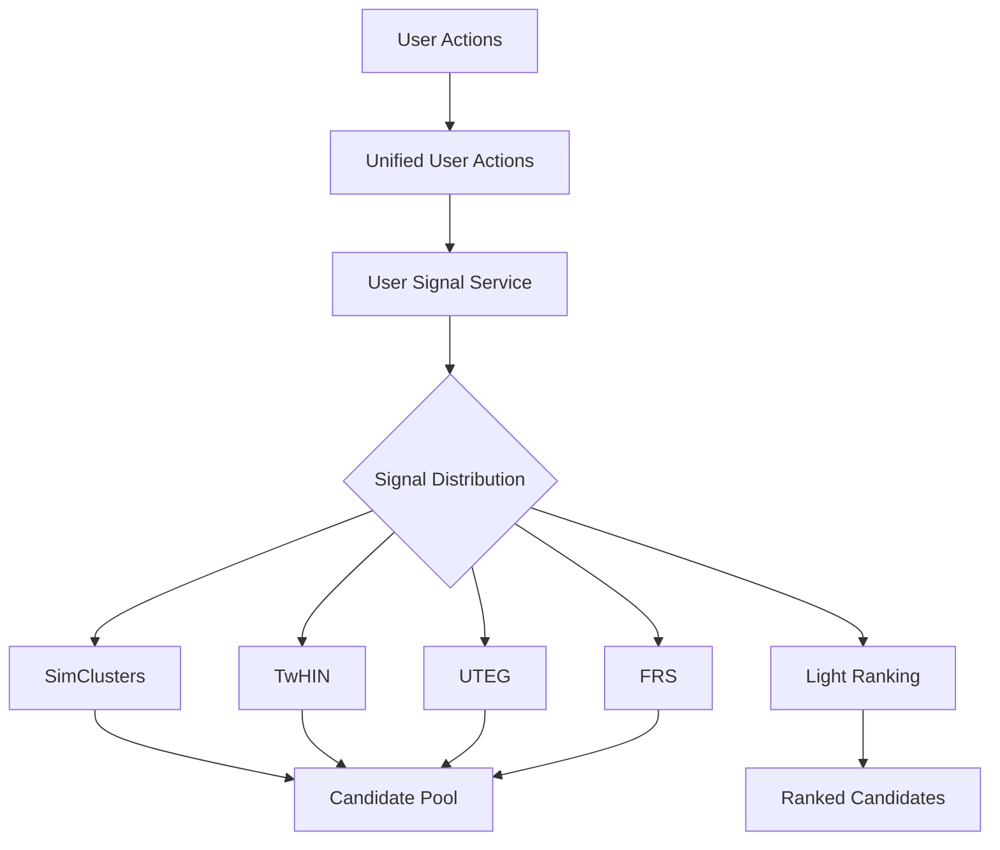

## Overview

The candidate sourcing stage within the Twitter Recommendation algorithm serves to significantly narrow down the item size from approximately **1 billion tweets** to just **a few thousand candidates**. This process utilizes Twitter user behavior as the primary input for the algorithm.

<Info>
This document comprehensively enumerates all the signals during the candidate sourcing phase and how they're used across different retrieval algorithms.
</Info>

## Signal Types

The following table describes all available signals used for candidate retrieval:

| Signal | Description |
| :--- | :--- |
| **Author Follow** | The accounts which user explicitly follows |
| **Author Unfollow** | The accounts which user recently unfollows |
| **Author Mute** | The accounts which user have muted |
| **Author Block** | The accounts which user have blocked |
| **Tweet Favorite** | The tweets which user clicked the like button |
| **Tweet Unfavorite** | The tweets which user clicked the unlike button |
| **Retweet** | The tweets which user retweeted |
| **Quote Tweet** | The tweets which user retweeted with comments |
| **Tweet Reply** | The tweets which user replied |
| **Tweet Share** | The tweets which user clicked the share button |
| **Tweet Bookmark** | The tweets which user clicked the bookmark button |
| **Tweet Click** | The tweets which user clicked and viewed the tweet detail page |
| **Tweet Video Watch** | The video tweets which user watched certain seconds or percentage |
| **Tweet Don't Like** | The tweets which user clicked "Not interested in this tweet" button |
| **Tweet Report** | The tweets which user clicked "Report Tweet" button |
| **Notification Open** | The push notification tweets which user opened |
| **Ntab Click** | The tweets which user click on the Notifications page |
| **User AddressBook** | The author accounts identifiers of the user's addressbook |

## Signal Usage by Component

Twitter uses these user signals as training labels and/or ML features in each candidate sourcing algorithm. The following table shows how they are used across different components:

<Note>
**Features**: Used as input features for the model  
**Labels**: Used as training objectives  
**Features / Labels**: Used for both purposes
</Note>

| Signal | USS | SimClusters | TwHIN | UTEG | FRS | Light Ranking |
| :--- | :--- | :--- | :--- | :--- | :--- | :--- |
| **Author Follow** | Features | Features / Labels | Features / Labels | Features | Features / Labels | N/A |
| **Author Unfollow** | Features | N/A | N/A | N/A | N/A | N/A |
| **Author Mute** | Features | N/A | N/A | N/A | Features | N/A |
| **Author Block** | Features | N/A | N/A | N/A | Features | N/A |
| **Tweet Favorite** | Features | Features | Features / Labels | Features | Features / Labels | Features / Labels |
| **Tweet Unfavorite** | Features | Features | N/A | N/A | N/A | N/A |
| **Retweet** | Features | N/A | Features / Labels | Features | Features / Labels | Features / Labels |
| **Quote Tweet** | Features | N/A | Features / Labels | Features | Features / Labels | Features / Labels |
| **Tweet Reply** | Features | N/A | Features | Features | Features / Labels | Features |
| **Tweet Share** | Features | N/A | N/A | N/A | Features | N/A |
| **Tweet Bookmark** | Features | N/A | N/A | N/A | N/A | N/A |
| **Tweet Click** | Features | N/A | N/A | N/A | Features | Labels |
| **Tweet Video Watch** | Features | Features | N/A | N/A | N/A | Labels |
| **Tweet Don't Like** | Features | N/A | N/A | N/A | N/A | N/A |
| **Tweet Report** | Features | N/A | N/A | N/A | N/A | N/A |
| **Notification Open** | Features | Features | Features | N/A | Features | N/A |
| **Ntab Click** | Features | Features | Features | N/A | Features | N/A |
| **User AddressBook** | N/A | N/A | N/A | N/A | Features | N/A |

## Component Overview

<CardGroup cols={3}>
  <Card title="USS" icon="database">
    **User Signal Service**  
    Centralizes all signals as features
  </Card>
  <Card title="SimClusters" icon="circle-nodes">
    **Similarity Clusters**  
    Uses engagement signals for clustering
  </Card>
  <Card title="TwHIN" icon="project-diagram">
    **Twitter Heterogeneous Information Network**  
    Graph-based candidate retrieval
  </Card>
  <Card title="UTEG" icon="users">
    **User-Tweet Entity Graph**  
    Real-time graph traversal for candidates
  </Card>
  <Card title="FRS" icon="user-plus">
    **Follow Recommendation Service**  
    Social graph signals for recommendations
  </Card>
  <Card title="Light Ranking" icon="ranking-star">
    **Lightweight Ranker**  
    Fast first-stage ranking
  </Card>
</CardGroup>

## Key Signal Patterns

### Positive Engagement Signals

Signals that indicate strong user interest:

<AccordionGroup>
  <Accordion title="Tweet Favorite">
    The most widely used signal across all components. Used as both features and labels in multiple systems including SimClusters, TwHIN, FRS, and Light Ranking.
  </Accordion>
  
  <Accordion title="Retweet">
    Strong engagement signal used as labels in TwHIN, FRS, and Light Ranking. Indicates user wants to share content with their followers.
  </Accordion>
  
  <Accordion title="Quote Tweet">
    Similar to retweet but with user commentary. Used as labels in TwHIN, FRS, and Light Ranking.
  </Accordion>
  
  <Accordion title="Author Follow">
    Social graph signal used extensively for understanding user preferences. Used as both features and labels in SimClusters, TwHIN, and FRS.
  </Accordion>
</AccordionGroup>

### Negative Signals

Signals that indicate user disinterest or spam:

<CardGroup cols={2}>
  <Card title="Author Block/Mute" icon="ban">
    Used in USS and FRS to filter out unwanted content and authors
  </Card>
  <Card title="Tweet Don't Like" icon="thumbs-down">
    Used in USS to understand content preferences
  </Card>
  <Card title="Tweet Report" icon="flag">
    Used in USS for spam and abuse detection
  </Card>
  <Card title="Author Unfollow" icon="user-minus">
    Used in USS to track changing user interests
  </Card>
</CardGroup>

### Implicit Signals

Weaker signals that provide contextual information:

- **Tweet Click**: Used in FRS as features and Light Ranking as labels
- **Video Watch**: Used in SimClusters and Light Ranking
- **Notification Open**: Used across multiple systems for engagement tracking

<Warning>
Implicit signals are noisier than explicit engagement signals and require careful calibration when used as training labels.
</Warning>

## Signal Processing Flow

## Best Practices

<Steps>
  <Step title="Signal Selection">
    Choose signals based on the specific retrieval algorithm and use case. Not all signals are relevant for all components.
  </Step>
  <Step title="Feature vs Label">
    Use strong engagement signals (favorites, retweets) as labels. Use broader signals as features.
  </Step>
  <Step title="Signal Freshness">
    Recent signals are more predictive. Consider recency weighting in feature engineering.
  </Step>
  <Step title="Negative Signals">
    Don't ignore negative signals - they're crucial for filtering and personalization.
  </Step>
</Steps>

## Related Components

<CardGroup cols={2}>
  <Card title="Unified User Actions" href="/data/unified-user-actions">
    Source of all user action signals
  </Card>
  <Card title="User Signal Service" href="/data/user-signals">
    Centralized signal processing platform
  </Card>
  <Card title="Aggregation Framework" href="/data/aggregation-framework">
    Computes aggregate features from signals
  </Card>
</CardGroup>