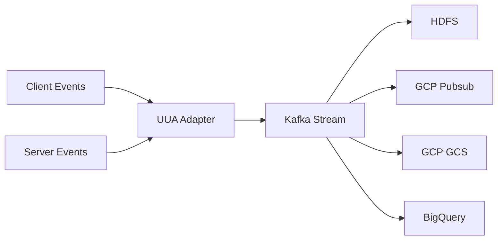

## Overview

**Unified User Actions** (UUA) is a centralized, real-time stream of user actions on Twitter, consumed by various product, ML, and marketing teams. UUA reads client-side and server-side event streams that contain the user's actions and generates a unified real-time user actions Kafka stream.

<Info>
The Kafka stream is replicated to multiple storage systems including HDFS, GCP Pubsub, GCP GCS, and GCP BigQuery for downstream consumption.
</Info>

## Action Types

UUA captures both public and implicit user actions:

### Public Actions
- **Favorites**: User likes on tweets
- **Retweets**: Sharing tweets to followers
- **Replies**: Direct responses to tweets

### Implicit Actions
- **Bookmarks**: Saved tweets for later
- **Impressions**: Tweet views in timeline
- **Video Views**: Video playback events

## Architecture Components

The UUA system is organized into four main components:

<CardGroup cols={2}>
  <Card title="Adapter" icon="shuffle">
    Transforms raw input events to UUA Thrift output format
  </Card>
  <Card title="Client" icon="plug">
    Kafka client utilities for stream consumption
  </Card>
  <Card title="Kafka" icon="stream">
    Specialized Kafka utilities including custom serialization/deserialization
  </Card>
  <Card title="Service" icon="server">
    Deployment modules and service configuration
  </Card>
</CardGroup>

### Data Flow

## Integration Points

UUA serves as the foundational data layer for:

<AccordionGroup>
  <Accordion title="Machine Learning">
    ML models consume UUA events as training labels and real-time features for candidate retrieval and ranking.
  </Accordion>
  <Accordion title="Product Analytics">
    Product teams track user engagement metrics and behavioral patterns.
  </Accordion>
  <Accordion title="Marketing">
    Marketing teams leverage action data for campaign optimization and user segmentation.
  </Accordion>
</AccordionGroup>

## Real-Time Processing

UUA is designed for real-time streaming with low latency requirements:

- Events are processed as they occur
- Multiple downstream consumers can read from the same stream
- Replication ensures data availability across different platforms
- Unified schema provides consistency across all action types

<Warning>
All user actions are processed in real-time, so downstream systems must be designed to handle high-throughput streaming data.
</Warning>

## Related Components

<CardGroup cols={2}>
  <Card title="User Signal Service" href="/data/user-signals">
    Processes UUA data into standardized signals
  </Card>
  <Card title="Retrieval Signals" href="/data/retrieval-signals">
    Uses UUA for candidate sourcing
  </Card>
</CardGroup>