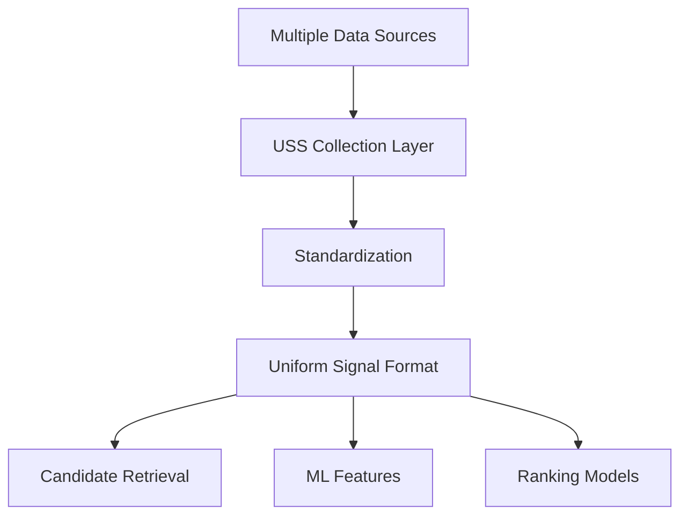

## Overview

**User Signal Service** (USS) is a centralized online platform that supplies comprehensive data on user actions and behaviors on Twitter. This information encompasses both explicit signals, such as favoriting, retweeting, and replying, as well as implicit signals, including tweet clicks, video views, profile visits, and more.

<Note>
USS gathers signals from various underlying datasets and online services, processing them into uniform formats for consistency across the recommendation pipeline.
</Note>

## Signal Types

### Explicit Signals

Explicit signals represent intentional user actions that directly express user preference:

<CardGroup cols={3}>
  <Card title="Favorites" icon="heart">
    User clicks the like button on tweets
  </Card>
  <Card title="Retweets" icon="retweet">
    User shares tweets to their followers
  </Card>
  <Card title="Replies" icon="comment">
    User responds directly to tweets
  </Card>
  <Card title="Bookmarks" icon="bookmark">
    User saves tweets for later viewing
  </Card>
  <Card title="Shares" icon="share">
    User shares tweets via external channels
  </Card>
  <Card title="Quote Tweets" icon="quote-left">
    User retweets with added commentary
  </Card>
</CardGroup>

### Implicit Signals

Implicit signals capture user behavior that indicates interest without explicit engagement:

<CardGroup cols={3}>
  <Card title="Tweet Clicks" icon="mouse-pointer">
    User clicks to view tweet details
  </Card>
  <Card title="Video Views" icon="video">
    Video playback duration and completion
  </Card>
  <Card title="Profile Visits" icon="user">
    User navigates to author profiles
  </Card>
  <Card title="Impressions" icon="eye">
    Tweets displayed in user timeline
  </Card>
  <Card title="Dwell Time" icon="clock">
    Time spent viewing content
  </Card>
  <Card title="Scrolls" icon="arrows-up-down">
    Scroll patterns and depth
  </Card>
</CardGroup>

## Data Processing Pipeline

## Standardization

USS ensures consistency and accuracy by:

1. **Collecting** signals from various underlying datasets and online services
2. **Processing** raw signals into uniform formats
3. **Validating** signal quality and consistency
4. **Distributing** standardized signals to downstream systems

<Info>
Standardized source signals are utilized in both candidate retrieval and as machine learning features for ranking stages.
</Info>

## Use Cases

<AccordionGroup>
  <Accordion title="Candidate Retrieval">
    USS signals help identify relevant candidates from Twitter's billion-scale corpus by understanding user preferences and historical behavior patterns.
  </Accordion>
  
  <Accordion title="Machine Learning Features">
    Signals are transformed into features for training and inference in ranking models, providing rich context about user-tweet interactions.
  </Accordion>
  
  <Accordion title="Real-Time Personalization">
    Recent signals enable dynamic personalization of timelines and recommendations based on current user interests.
  </Accordion>
  
  <Accordion title="Model Training">
    Historical signals serve as training labels for supervised learning models across the recommendation pipeline.
  </Accordion>
</AccordionGroup>

## Signal Quality

USS maintains high signal quality through:

- **Deduplication**: Removing duplicate events
- **Validation**: Ensuring signal integrity and format compliance
- **Filtering**: Removing spam and invalid actions
- **Normalization**: Consistent timestamp and identifier formats

<Warning>
Signal quality directly impacts recommendation quality. USS applies strict validation to ensure only high-quality signals reach downstream systems.
</Warning>

## Integration with Data Pipeline

USS integrates with other components in the data pipeline:

<Steps>
  <Step title="Unified User Actions">
    Consumes raw action events from the UUA stream
  </Step>
  <Step title="Signal Processing">
    Processes and standardizes signals for downstream use
  </Step>
  <Step title="Feature Generation">
    Provides signals to the Aggregation Framework for feature computation
  </Step>
  <Step title="Candidate Retrieval">
    Supplies signals for retrieval algorithms (SimClusters, TwHIN, UTEG)
  </Step>
</Steps>

## Related Components

<CardGroup cols={2}>
  <Card title="Unified User Actions" href="/data/unified-user-actions">
    Source of raw user action events
  </Card>
  <Card title="Retrieval Signals" href="/data/retrieval-signals">
    How signals are used in candidate sourcing
  </Card>
  <Card title="Aggregation Framework" href="/data/aggregation-framework">
    Transforms signals into aggregate features
  </Card>
</CardGroup>