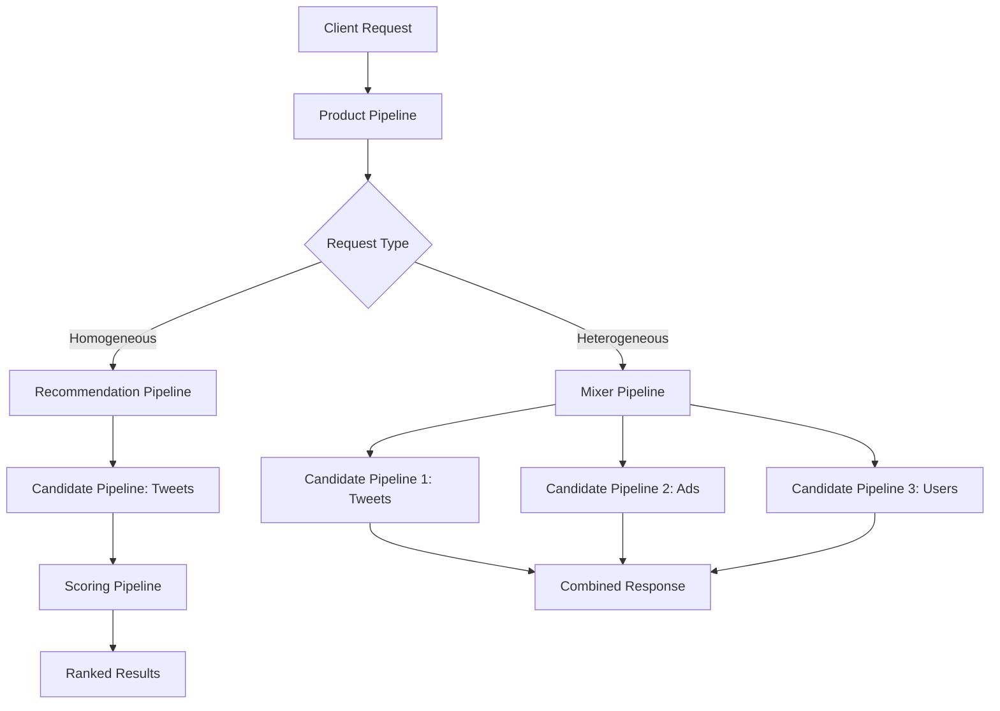

# Product Mixer

Product Mixer is a common service framework and set of libraries that make it easy to build, iterate on, and own product surface areas at X. It provides the foundation for building execution pipelines out of reusable components with built-in monitoring and observability.

## Overview

Product Mixer enables teams to focus on business logic rather than infrastructure concerns by providing:

- **Core Libraries**: Build execution pipelines from small, well-defined, reusable components
- **Service Framework**: Common service skeleton for hosting Product Mixer products
- **Component Library**: Shared library of components from the Product Mixer team and community contributors

## Architecture

Product Mixer applications are built from two main concepts: **Pipelines** and **Components**.

### Components

Components break business logic into separate, standardized, reusable, testable, and easily composable pieces. Each component has a well-defined abstraction and single responsibility.

**Component Types:**
- **Candidate Sources**: Fetch candidates from underlying services
- **Filters**: Remove unwanted candidates based on criteria
- **Scorers**: Score and rank candidates
- **Decorators**: Add additional information to candidates
- **Gates**: Control pipeline execution flow
- **Transformers**: Modify candidate data

### Pipelines

Pipelines are configuration files that specify which components to use and when. They make code execution transparent and maintainable.

```scala
// Example Pipeline Configuration (simplified)
class ExamplePipeline extends RecommendationPipeline {
  override val candidatePipelines: Seq[CandidatePipeline] = Seq(
    InNetworkCandidatePipeline,
    OutOfNetworkCandidatePipeline
  )
  
  override val scoringPipeline: ScoringPipeline = 
    HeavyRankerScoringPipeline
    
  override val filters: Seq[Filter] = Seq(
    AuthorDiversityFilter,
    VisibilityFilter
  )
}
```

## Pipeline Hierarchy

<Steps>
  <Step title="Product Pipeline">
    Entry point that selects which Mixer or Recommendation Pipeline to run for a given request
    
    ```scala
    ProductPipeline
      ├── Request validation
      ├── Pipeline selection logic
      └── Route to appropriate pipeline
    ```
  </Step>
  
  <Step title="Mixer Pipeline">
    Combines results from multiple **heterogeneous** Candidate Pipelines (e.g., tweets, ads, users)
    
    ```scala
    MixerPipeline
      ├── Multiple Candidate Pipelines (different types)
      ├── Marshalling to domain objects
      └── Transport object creation
    ```
  </Step>
  
  <Step title="Recommendation Pipeline">
    Scores and ranks results from **homogeneous** Candidate Pipelines, returning top-ranked items
    
    ```scala
    RecommendationPipeline
      ├── Candidate Pipelines (same type)
      ├── Scoring Pipeline
      ├── Ranking logic
      └── Top-N selection
    ```
  </Step>
  
  <Step title="Candidate Pipeline">
    Fetches candidates from sources and performs basic operations (filtering, decoration, feature hydration)
    
    ```scala
    CandidatePipeline
      ├── Candidate Source query
      ├── Filters
      ├── Decorators
      └── Feature hydration
    ```
  </Step>
  
  <Step title="Scoring Pipeline">
    Applies ML models to score candidates for ranking
    
    ```scala
    ScoringPipeline
      ├── Feature hydration
      ├── Model inference
      └── Score assignment
    ```
  </Step>
</Steps>

## Request Flow



## Component Composition

Components are designed to be highly reusable across different pipelines:

<CodeGroup>
```scala Candidate Source
class EarlybirdCandidateSource extends CandidateSource {
  override def apply(
    request: Request
  ): Stitch[Seq[TweetCandidate]] = {
    // Query search index
    earlybirdClient.search(
      query = request.query,
      numResults = request.maxResults
    ).map(_.results.map(TweetCandidate(_)))
  }
}
```

```scala Filter
class AuthorDiversityFilter extends Filter {
  override def apply(
    candidates: Seq[Candidate]
  ): Stitch[Seq[Candidate]] = {
    // Ensure diversity of authors
    val grouped = candidates.groupBy(_.authorId)
    val diverse = grouped.flatMap { case (author, tweets) =>
      tweets.take(maxPerAuthor)
    }
    Stitch.value(diverse.toSeq)
  }
}
```

```scala Scorer
class HeavyRankerScorer extends Scorer {
  override def apply(
    candidates: Seq[Candidate]
  ): Stitch[Seq[ScoredCandidate]] = {
    // Score candidates using ML model
    naviClient.predict(
      model = "heavy_ranker",
      features = candidates.map(_.features)
    ).map { scores =>
      candidates.zip(scores).map { case (c, s) =>
        ScoredCandidate(c, s)
      }
    }
  }
}
```
</CodeGroup>

## Home Mixer Example

**Home Mixer** is X's main service for constructing Home Timelines, built entirely on Product Mixer.

### For You Timeline Pipeline Structure

<Accordion title="ForYouProductPipelineConfig">
  Top-level product pipeline for the For You timeline
  
  <Accordion title="ForYouScoredTweetsMixerPipelineConfig">
    Main orchestration layer - mixes Tweets with ads and users
    
    <Accordion title="ForYouScoredTweetsCandidatePipelineConfig">
      Fetches Tweet candidates
      
      <Accordion title="ScoredTweetsRecommendationPipelineConfig">
        Main Tweet recommendation layer
        
        **Candidate Pipelines:**
        - `ScoredTweetsInNetworkCandidatePipelineConfig` - In-network tweets
        - `ScoredTweetsTweetMixerCandidatePipelineConfig` - Mixed sources
        - `ScoredTweetsUtegCandidatePipelineConfig` - UTEG graph traversal
        - `ScoredTweetsFrsCandidatePipelineConfig` - Follow recommendations
        
        **Scoring:**
        - `ScoredTweetsScoringPipelineConfig` - Feature hydration and ML ranking
      </Accordion>
    </Accordion>
    
    **Additional Pipelines:**
    - `ForYouConversationServiceCandidatePipelineConfig` - Backup reverse chron
    - `ForYouAdsCandidatePipelineConfig` - Ad candidates
    - `ForYouWhoToFollowCandidatePipelineConfig` - User recommendations
  </Accordion>
</Accordion>

### Following Timeline Pipeline Structure

```scala
FollowingProductPipelineConfig
  └── FollowingMixerPipelineConfig
      ├── FollowingEarlybirdCandidatePipelineConfig
      ├── ConversationServiceCandidatePipelineConfig
      ├── FollowingAdsCandidatePipelineConfig
      └── FollowingWhoToFollowCandidatePipelineConfig
```

### Lists Timeline Pipeline Structure

```scala
ListTweetsProductPipelineConfig
  └── ListTweetsMixerPipelineConfig
      ├── ListTweetsTimelineServiceCandidatePipelineConfig
      ├── ConversationServiceCandidatePipelineConfig
      └── ListTweetsAdsCandidatePipelineConfig
```

## Key Benefits

<CardGroup cols={2}>
  <Card title="Reusability" icon="recycle">
    Write components once, use across multiple pipelines and products
  </Card>
  <Card title="Testability" icon="vial">
    Small, well-defined components are easy to unit test in isolation
  </Card>
  <Card title="Maintainability" icon="wrench">
    Clear pipeline structure makes code easy to understand and modify
  </Card>
  <Card title="Observability" icon="chart-line">
    Built-in monitoring and metrics for all pipeline stages
  </Card>
  <Card title="Type Safety" icon="shield-check">
    Scala's type system catches errors at compile time
  </Card>
  <Card title="Composability" icon="puzzle-piece">
    Mix and match components to create new products quickly
  </Card>
</CardGroup>

## Component Library

Product Mixer includes a shared component library with pre-built components:

- **Candidate Sources**: Earlybird, UTEG, FRS, Cr Mixer
- **Filters**: Visibility, Author Diversity, Content Balance, Feedback Fatigue
- **Scorers**: Light Ranker, Heavy Ranker, Engagement Predictor
- **Decorators**: Social Context, Conversation Modules, Feedback Options
- **Marshalling**: Timeline instructions, Transport format converters

## Performance Characteristics

<Note>
  Product Mixer uses **Stitch** (X's asynchronous programming library) for efficient concurrent execution and automatic batching of requests.
</Note>

**Execution Model:**
- Parallel execution of independent pipeline stages
- Automatic request batching to downstream services
- Configurable timeouts and fallbacks
- Circuit breakers for resilience

## Learn More

<CardGroup cols={2}>
  <Card title="Candidate Generation" href="/ml/candidate-generation" icon="filter">
    Learn about candidate sourcing strategies
  </Card>
  <Card title="Ranking Systems" href="/ml/ranking" icon="ranking-star">
    Explore light and heavy ranking pipelines
  </Card>
  <Card title="Navi ML Serving" href="/ml/navi" icon="server">
    Understand the ML serving infrastructure
  </Card>
</CardGroup>