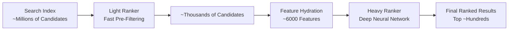

# Ranking Systems

X's recommendation pipeline uses a two-stage ranking architecture to efficiently score millions of candidates and select the most relevant content for users. This approach balances computational efficiency with prediction accuracy.

## Overview

The ranking system consists of two complementary models:

<CardGroup cols={2}>
  <Card title="Light Ranker" icon="bolt">
    Fast, lightweight model that pre-filters candidates from the search index. Reduces millions of candidates to thousands.
  </Card>
  <Card title="Heavy Ranker" icon="brain">
    Sophisticated neural network that performs detailed scoring on the filtered candidates. Produces final ranking scores.
  </Card>
</CardGroup>

## Two-Stage Ranking Architecture



## Light Ranker

The light ranker is a lightweight ML model integrated directly into the Earlybird search index. It performs rapid scoring during candidate retrieval.

### Architecture

<Tabs>
  <Tab title="Purpose">
    **Objective**: Pre-filter candidates from millions to thousands
    
    - Runs **in-index** during search query execution
    - Optimized for **low latency** (sub-millisecond per candidate)
    - Uses **limited features** available in the search index
    - Trained using **TWML framework** (TensorFlow v1)
  </Tab>
  
  <Tab title="Features">
    **Available Features** (limited to search index data):
    
    - Tweet age and recency
    - Author reputation (TweepCred score)
    - Early engagement signals (first hour metrics)
    - Tweet content signals (has media, has URL, length)
    - User-author relationship (following, mutual follows)
    - Static tweet features (language, source)
    
    <Note>
      Light ranker uses ~100-200 features vs ~6000 for heavy ranker
    </Note>
  </Tab>
  
  <Tab title="Model">
    **Model Architecture**: Shallow neural network
    
    ```python
    # Simplified light ranker architecture
    def light_ranker_model(features):
        # Input: sparse + dense features
        embeddings = embed_sparse_features(features, size=32)
        dense = features.dense_features
        
        # Combine features
        combined = concat([embeddings, dense])
        
        # 2-3 hidden layers (256 -> 128 units)
        h1 = dense_layer(combined, 256, activation='relu')
        h2 = dense_layer(h1, 128, activation='relu')
        
        # Single output score
        score = dense_layer(h2, 1)
        return score
    ```
  </Tab>
</Tabs>

### Training Process

The light ranker is trained using the TWML framework:

<Steps>
  <Step title="Data Collection">
    Collect user engagement data from production logs:
    
    ```python
    # Training labels from user actions
    labels = {
        'click': 1 if user_clicked else 0,
        'video_watch_time': seconds_watched,
        'favorite': 1 if user_favorited else 0,
        'retweet': 1 if user_retweeted else 0,
    }
    ```
  </Step>
  
  <Step title="Feature Engineering">
    Extract features available in search index:
    
    - Static tweet metadata
    - Author statistics
    - Early engagement metrics
    - User-author graph signals
  </Step>
  
  <Step title="Model Training">
    Train using DataRecordTrainer in TWML:
    
    ```bash
    # Located in:
    # src/python/twitter/deepbird/projects/timelines/scripts/models/earlybird/
    
    python train.py \
      --train_data=/data/training \
      --eval_data=/data/eval \
      --model_dir=/models/light_ranker
    ```
  </Step>
  
  <Step title="Model Export & Deployment">
    Export model and deploy to Earlybird search index instances
  </Step>
</Steps>

### Integration with Earlybird

The light ranker runs inside the Earlybird search index:

```scala
// Simplified Earlybird integration
class EarlybirdSearcher {
  def search(query: Query): Seq[Tweet] = {
    // 1. Retrieve candidates from index
    val candidates = index.query(query.terms)
    
    // 2. Score with light ranker
    val scored = candidates.map { tweet =>
      val features = extractIndexFeatures(tweet)
      val score = lightRanker.score(features)
      ScoredTweet(tweet, score)
    }
    
    // 3. Return top K candidates
    scored.sortBy(-_.score).take(query.numResults)
  }
}
```

### Performance Characteristics

<CardGroup cols={2}>
  <Card title="Latency" icon="clock">
    Sub-millisecond scoring per candidate, enabling real-time search
  </Card>
  <Card title="Throughput" icon="gauge-high">
    Scores millions of candidates per second across search fleet
  </Card>
  <Card title="Selectivity" icon="filter">
    Reduces ~1M candidates to ~2-5K for downstream processing
  </Card>
  <Card title="Accuracy" icon="bullseye">
    High recall (keeps most relevant candidates) with good precision
  </Card>
</CardGroup>

## Heavy Ranker

The heavy ranker is a sophisticated neural network that performs detailed scoring on candidates that pass the light ranker.

### Architecture

<Tabs>
  <Tab title="Purpose">
    **Objective**: Final ranking with maximum accuracy
    
    - Runs **out-of-index** as a separate service
    - Uses **~6000 features** from multiple sources
    - Employs **deep neural networks** for complex patterns
    - Trained using **PyTorch** framework
    - Multi-task learning for various engagement objectives
  </Tab>
  
  <Tab title="Features">
    **Feature Categories** (~6000 total features):
    
    <AccordionGroup>
      <Accordion title="User Features" icon="user">
        - Demographics and account age
        - Historical engagement patterns
        - Topic preferences
        - Language and locale
        - Follower/following counts and ratios
        - Account reputation signals
      </Accordion>
      
      <Accordion title="Tweet Features" icon="message">
        - Content embeddings (text, images)
        - Engagement metrics (likes, retweets, replies)
        - Author credibility
        - Topic classifications
        - Media presence and type
        - URL and hashtag features
      </Accordion>
      
      <Accordion title="User-Tweet Features" icon="link">
        - User-author relationship strength (Real Graph)
        - Topic alignment
        - Historical engagement with similar content
        - Social proof (mutual follows who engaged)
        - Temporal patterns
      </Accordion>
      
      <Accordion title="Context Features" icon="clock">
        - Time of day and day of week
        - User's current session activity
        - Recent engagement history
        - Device and platform
      </Accordion>
      
      <Accordion title="Graph Features" icon="network-wired">
        - SimClusters embeddings
        - TwHIN embeddings
        - Real Graph scores
        - Community overlap
      </Accordion>
    </AccordionGroup>
  </Tab>
  
  <Tab title="Model">
    **Model Architecture**: Deep neural network with multi-task learning
    
    ```python
    # Simplified heavy ranker architecture
    class HeavyRanker(nn.Module):
        def __init__(self):
            super().__init__()
            
            # Feature processing towers
            self.user_tower = MLP([1024, 512, 256])
            self.tweet_tower = MLP([1024, 512, 256])
            self.cross_tower = MLP([2048, 1024, 512])
            
            # Multi-task heads
            self.engagement_head = MLP([512, 256, 128, 1])
            self.like_head = MLP([512, 256, 128, 1])
            self.retweet_head = MLP([512, 256, 128, 1])
            self.reply_head = MLP([512, 256, 128, 1])
            
        def forward(self, user_features, tweet_features, cross_features):
            # Process feature towers
            user_emb = self.user_tower(user_features)
            tweet_emb = self.tweet_tower(tweet_features)
            cross_emb = self.cross_tower(cross_features)
            
            # Combine representations
            combined = torch.cat([user_emb, tweet_emb, cross_emb])
            
            # Multi-task predictions
            engagement = self.engagement_head(combined)
            like = self.like_head(combined)
            retweet = self.retweet_head(combined)
            reply = self.reply_head(combined)
            
            # Weighted combination for final score
            score = (
                0.5 * engagement +
                0.3 * like +
                0.15 * retweet +
                0.05 * reply
            )
            
            return score, (engagement, like, retweet, reply)
    ```
  </Tab>
</Tabs>

### Training Process

The heavy ranker uses modern deep learning techniques:

<Steps>
  <Step title="Feature Hydration">
    Collect comprehensive features from multiple services:
    
    ```scala
    // Feature hydration pipeline
    val features = Future.join(
      userSignalService.getFeatures(userId),
      socialGraphService.getFeatures(userId, authorId),
      tweetInfoService.getFeatures(tweetId),
      embeddingService.getEmbeddings(userId, tweetId)
    )
    ```
  </Step>
  
  <Step title="Training Data Generation">
    Generate training examples from production engagement:
    
    ```python
    # Multi-task labels
    example = {
        'features': feature_vector,  # ~6000 features
        'labels': {
            'engagement': 1.0,  # User engaged
            'like': 1.0,        # User liked
            'retweet': 0.0,     # No retweet
            'reply': 0.0,       # No reply
            'dwell_time': 45.2, # Seconds spent
        }
    }
    ```
  </Step>
  
  <Step title="Model Training (PyTorch)">
    Train using multi-task learning:
    
    ```python
    # Training loop
    for batch in train_loader:
        # Forward pass
        score, task_outputs = model(
            batch['user_features'],
            batch['tweet_features'], 
            batch['cross_features']
        )
        
        # Multi-task loss
        engagement_loss = bce_loss(
            task_outputs[0], batch['labels']['engagement']
        )
        like_loss = bce_loss(
            task_outputs[1], batch['labels']['like']
        )
        # ... other task losses
        
        total_loss = (
            engagement_loss + like_loss + 
            retweet_loss + reply_loss
        )
        
        # Backward pass
        total_loss.backward()
        optimizer.step()
    ```
  </Step>
  
  <Step title="Model Serving">
    Deploy to Navi serving infrastructure:
    
    ```bash
    # Export to ONNX for Navi serving
    torch.onnx.export(
        model,
        example_inputs,
        'heavy_ranker.onnx'
    )
    ```
  </Step>
</Steps>

### Integration with Home Mixer

The heavy ranker is called from Home Mixer's scoring pipeline:

```scala
// Home Mixer scoring pipeline
class ScoredTweetsScoringPipelineConfig extends ScoringPipeline {
  
  override val scorers: Seq[Scorer] = Seq(
    HeavyRankerScorer
  )
  
  override def apply(
    candidates: Seq[Tweet]
  ): Stitch[Seq[ScoredTweet]] = {
    // 1. Hydrate features for candidates
    val features = featureHydrator.hydrate(candidates)
    
    // 2. Call Navi for model inference
    naviClient.predict(
      model = "heavy_ranker_prod",
      features = features
    ).map { scores =>
      // 3. Attach scores to candidates
      candidates.zip(scores).map { case (tweet, score) =>
        ScoredTweet(tweet, score)
      }
    }
  }
}
```

### Performance Characteristics

<CardGroup cols={2}>
  <Card title="Latency" icon="hourglass">
    10-50ms per batch of candidates (depends on batch size)
  </Card>
  <Card title="Throughput" icon="chart-line">
    Thousands of candidates scored per second per instance
  </Card>
  <Card title="Accuracy" icon="trophy">
    State-of-the-art engagement prediction with multi-task learning
  </Card>
  <Card title="Features" icon="layer-group">
    ~6000 features from diverse sources for rich representation
  </Card>
</CardGroup>

## Push Notifications Ranking

The push notification system uses a similar two-stage architecture:

### Light Ranker (Pushservice)

<Card title="Pre-Rank Filtering" icon="filter">
  Located in: `pushservice/src/main/python/models/light_ranking/`
  
  **Purpose**: Bridge candidate generation and heavy ranking by pre-selecting highly-relevant candidates
  
  - Lightweight RPC calls for filtering
  - Reduces candidate pool before expensive heavy ranking
  - Fast decision making for real-time notifications
</Card>

### Heavy Ranker (Pushservice)

<Card title="Final Ranking" icon="ranking-star">
  Located in: `pushservice/src/main/python/models/heavy_ranking/`
  
  **Purpose**: Multi-task learning model for final notification selection
  
  **Predictions**:
  - Probability user will **open** the notification
  - Probability user will **engage** with the content
  - Combined score for notification prioritization
</Card>

## Ranking Pipeline Comparison

| Aspect | Light Ranker | Heavy Ranker |
|--------|--------------|---------------|
| **Location** | In-index (Earlybird) | Separate service (Navi) |
| **Features** | ~100-200 | ~6000 |
| **Model Size** | Small (MBs) | Large (GBs) |
| **Latency** | Under 1ms per candidate | 10-50ms per batch |
| **Framework** | TWML (TensorFlow v1) | PyTorch |
| **Architecture** | Shallow MLP | Deep multi-task network |
| **Purpose** | Candidate pre-filtering | Final ranking |
| **Candidates In** | ~Millions | ~Thousands |
| **Candidates Out** | ~Thousands | ~Hundreds |

## Learn More

<CardGroup cols={2}>
  <Card title="TWML Framework" href="/ml/twml" icon="brain">
    Learn about the framework used to train light ranker models
  </Card>
  <Card title="Navi ML Serving" href="/ml/navi" icon="server">
    Understand how heavy ranker models are served in production
  </Card>
  <Card title="Candidate Generation" href="/ml/candidate-generation" icon="filter">
    Explore how candidates are sourced before ranking
  </Card>
  <Card title="Product Mixer" href="/ml/product-mixer" icon="blender">
    See how ranking integrates into the full pipeline
  </Card>
</CardGroup>